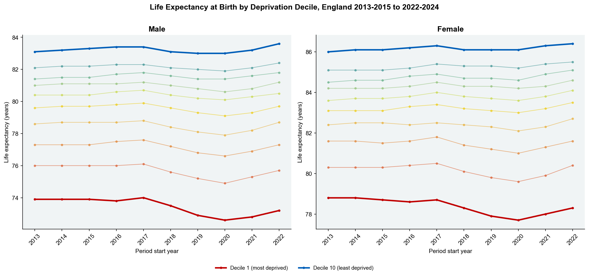
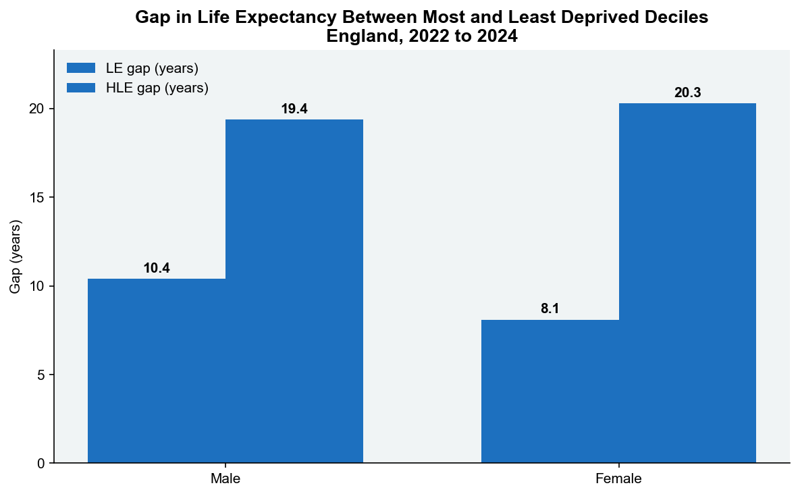
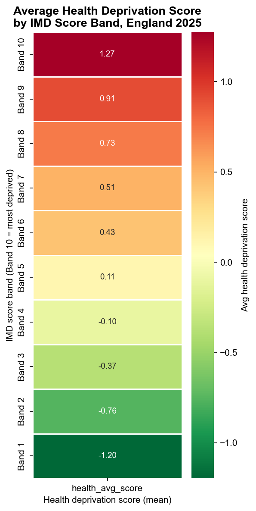
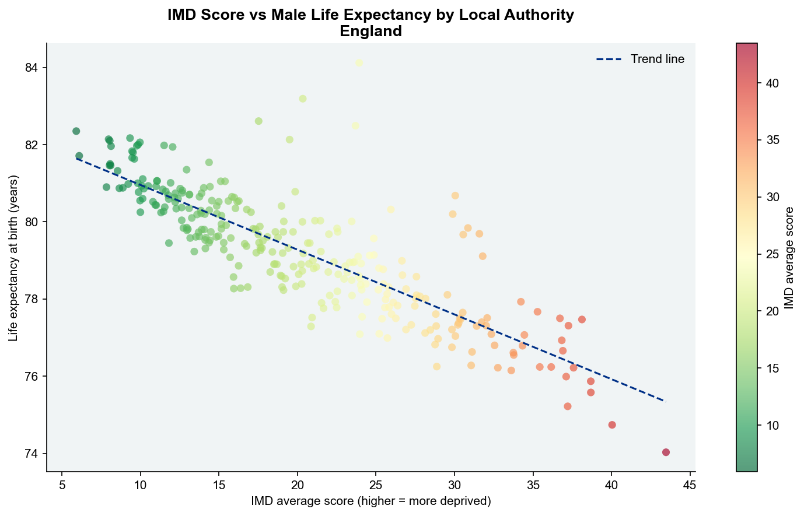
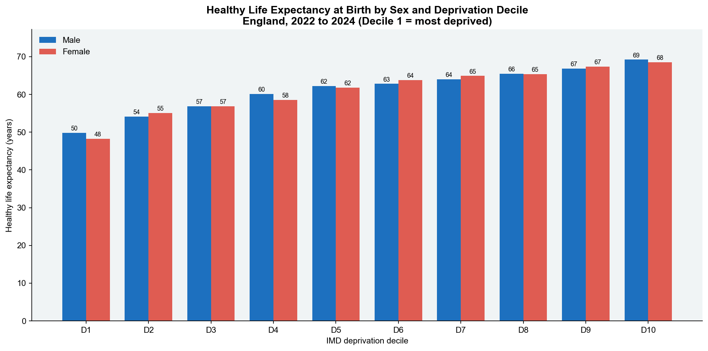

# NHS Health Inequalities: ETL Pipeline and Analysis

Health inequalities in England are among the most persistent and well-documented in the developed world. People living in the most deprived areas die, on average, 10 years earlier than those in the least deprived, and spend nearly 20 fewer years in good health. Despite successive public health strategies, this gap has not meaningfully narrowed. This project merges three government datasets to quantify the scale, direction, and geographic distribution of these inequalities, producing analysis at both national and local authority level.

## Data Sources

| Source | Description | Link |
|---|---|---|
| ONS Healthy Life Expectancy by Deprivation | Life expectancy and healthy life expectancy by IMD decile, England, 2013-2015 to 2022-2024 | [ONS](https://www.ons.gov.uk/peoplepopulationandcommunity/healthandsocialcare/healthinequalities/datasets/healthylifeexpectancybynationalareadeprivationenglandtimeseries) |
| English Indices of Deprivation 2025 (IMD25) | Deprivation scores, ranks and deciles for all LSOAs and local authority districts in England | [GOV.UK](https://www.gov.uk/government/statistics/english-indices-of-deprivation-2025) |
| ONS Life Expectancy by Local Authority | Life expectancy time series for all English local authority districts | [ONS](https://www.ons.gov.uk/datasets/life-expectancy-by-local-authority/editions/time-series/versions/1) |

## Key Findings

- **10.4-year gap in male life expectancy** between the most and least deprived areas in England (73.2 years vs 83.6 years, 2022-2024). The equivalent gap for females is 8.1 years.

- **19.4-year gap in male healthy life expectancy** between the most and least deprived deciles (49.8 vs 69.2 years). Men in the most deprived areas spend 23.4 years in poor health, compared to 14.4 years in the least deprived. For women, the HLE gap is 20.3 years.

- **The inequality gap has not closed.** Comparing 2013-2015 to 2022-2024, the absolute gap in healthy life expectancy between the most and least deprived deciles has remained broadly stable. There is no meaningful convergence across the decade.

- **COVID-19 widened the gap temporarily.** The 2019-2021 and 2020-2022 rolling periods show a dip in LE across all deciles, but the decline was proportionally steeper for the most deprived, consistent with the well-documented disproportionate impact of COVID on deprived communities.

- **Geographic concentration is severe.** Local authorities in the North East and North West have the highest concentration of LSOAs in the most deprived national decile. Blackpool has the highest average IMD score of any local authority in England.

- **Health deprivation diverges from overall deprivation in some areas.** Several local authorities rank significantly worse on the health deprivation domain than their overall IMD rank would suggest, indicating that health outcomes are shaped by factors beyond income and employment alone.

## Tools Used

| Tool | Purpose |
|---|---|
| Python (pandas, matplotlib, seaborn) | ETL pipeline, data cleaning, visualisations |
| SQL Server Express | Data storage and analytical queries |
| xlsxwriter | Stakeholder Excel workbook |
| Power BI Desktop | Interactive dashboard |

## Screenshots

### Python Charts

| Chart | Preview |
|---|---|
| Life expectancy trend by deprivation decile |  |
| LE and HLE gap between most and least deprived |  |
| Health deprivation score by IMD band (heatmap) |  |
| IMD score vs life expectancy by local authority |  |
| Healthy life expectancy by sex and deprivation decile |  |

### Power BI Dashboard

*Screenshots to be added after Power BI development.*
